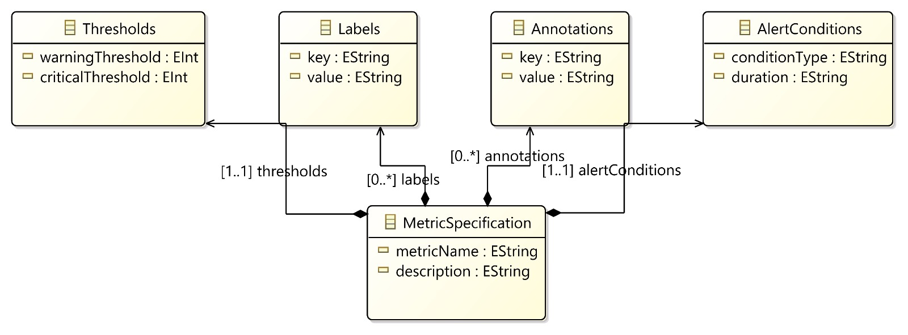
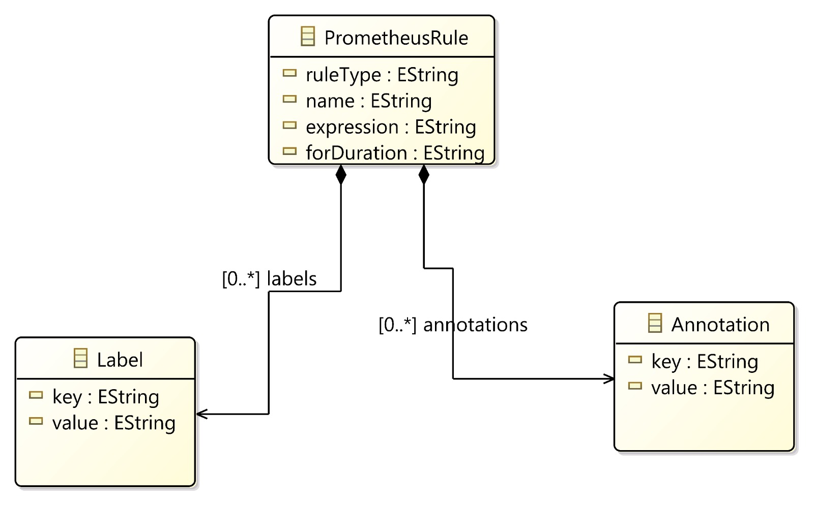
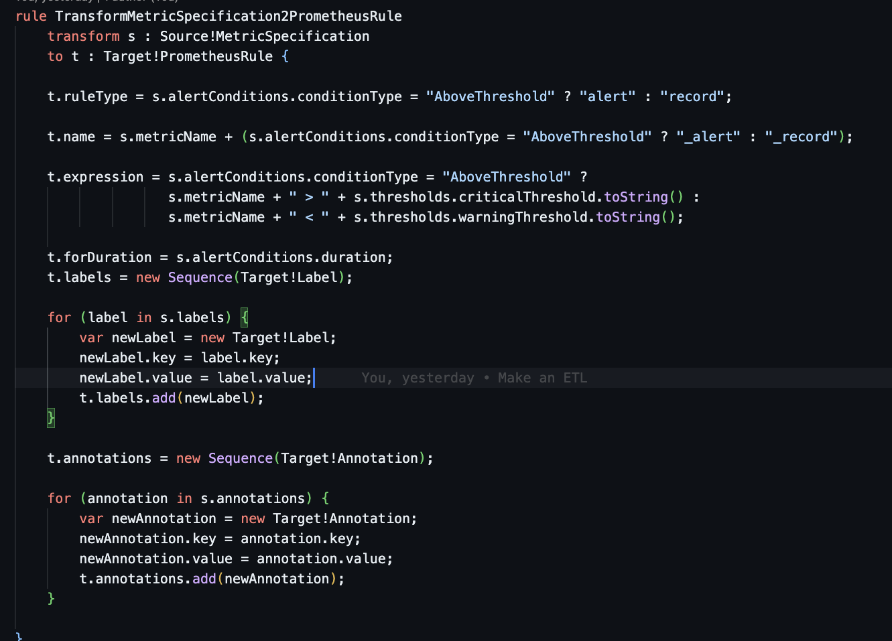
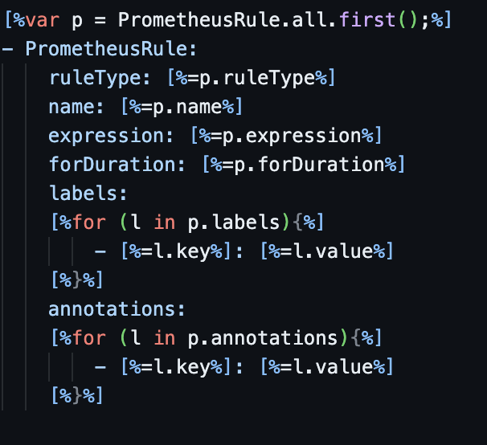

## Introduction

In the ever-evolving landscape of software development and operations, DevOps practices are integral in accelerating deployment and maintaining applications. Effective monitoring of application performance is a crucial component for maintaining reliability and service health. However, the complexity and time-consuming nature of configuring monitoring tools like Prometheus can be a significant hurdle.

## Problem Statement

A primary challenge in DevOps is the efficient generation of monitoring rules for applications. The manual process of translating application metrics specifications into detailed Prometheus monitoring rules is error-prone and time-consuming. This manual approach hinders the rapid deployment and iterative development that are essential in effective DevOps practices.

## Proposed Solution

This project introduces a web-based application designed to automate the generation of Prometheus monitoring rules from user-defined application metrics specifications. Utilizing Model-Driven Engineering (MDE), the application will transform metrics into detailed Prometheus alerting and recording rules in YAML format. Developed using Spring Boot and React JS, it will provide an intuitive interface for inputting metrics specifications. The backend will process this input, converting it into Prometheus-compatible rules, thus providing users with ready-to-use YAML files for their monitoring setup. This solution aims to simplify the monitoring setup process, ensuring accuracy and consistency in the Prometheus rules generation, and enhancing the efficiency of DevOps workflows.

## Selected metamodels

<h3>Source Meta Model : Application Metrics Specification </h3>

- The Source Metamodel is centered around `MetricSpecification`, which defines metrics, their names, alert conditions, thresholds, labels, and annotations.
- `MetricSpecification` includes:
  - `metricName`: The name of the metric.
  - `alertConditions`: Conditions under which alerts should be triggered.
  - `thresholds`: Defined critical and warning thresholds for metrics.
  - `labels`: Key-value pairs for metric categorization.
  - `annotations`: Additional information associated with the metric.

<h3>Target Meta Model : Promotheus Rule YAML </h3>

- The Target Metamodel is designed for `PrometheusRule`, which is used for alerting and recording rules in Prometheus.
- `PrometheusRule` includes:
  - `ruleType`: Determines if the rule is an alert or a record.
  - `name`: The name of the rule, based on the metric name and its type.
  - `expression`: The logic or condition defining the rule.
  - `forDuration`: The duration for which the condition must be true.
  - `labels`: Key-value pairs used for filtering and aggregation.
  - `annotations`: Descriptive information providing more context about the rule.

## Transformation Playground

- This ATL rule transforms a `MetricSpecification` into a `PrometheusRule`.
- The `ruleType` is determined based on the `conditionType` of the `alertConditions` in the source metamodel.
- The `name`, `expression`, `forDuration`, `labels`, and `annotations` are mapped and transformed from the source to the target metamodel.

## Generation Playground

- The EGL template provides a textual representation of a `PrometheusRule` instance.
- It visualizes the properties of `PrometheusRule` like `ruleType`, `name`, `expression`, along with its `labels` and `annotations`.
- The template is designed to iterate over the `labels` and `annotations` collections, displaying each key-value pair.
